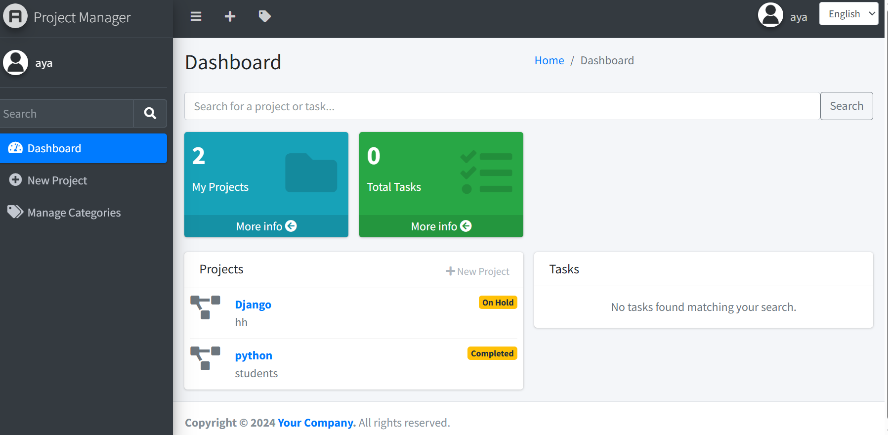

# 📋 Project Manager Dashboard

A modern, web-based Project Management System built with **Django** and **AdminLTE 3**. This application allows users to organize projects, track tasks, and manage categories through an intuitive and responsive dashboard.

---

## 🚀 Key Features

* **Comprehensive Dashboard:** Real-time statistics for projects and tasks.
* **Project Tracking:** Manage project lifecycles with status indicators like "On Hold" and "Completed".
* **Task Management:** Add detailed tasks to projects with priority tags and deadlines.
* **Smart Search:** Quickly filter through projects and tasks using the integrated search bar.
* **Category System:** Organize work by creating and managing project categories.
* **Multilingual Support:** Switch between English and Arabic interfaces easily.

---

## 🛠 Technical Stack

* **Backend:** Python, Django
* **Frontend:** HTML5, CSS3, JavaScript, Bootstrap 5, AdminLTE 3
* **Database:** PostgreSQL
* **Tools:** Git, GitHub

---

## 📸 Interface Preview

|         Dashboard & Overview          |           Project & Task Details            |
| :-----------------------------------: | :-----------------------------------------: |
|  |  |

|         Category Management          |         Search Results         |
| :----------------------------------: | :----------------------------: |
|  |  |
|                                      |                                |

---

## ⚙️ Quick Start

### 1. Prerequisites
* Python 3.8+
* PostgreSQL
* pip

### 2. Installation
```bash
# Clone the repository
git clone [https://github.com/YOUR_USERNAME/YOUR_REPO.git](https://github.com/YOUR_USERNAME/YOUR_REPO.git)

# Navigate to project folder
cd YOUR_REPO

# Install dependencies
pip install -r requirements.txt
