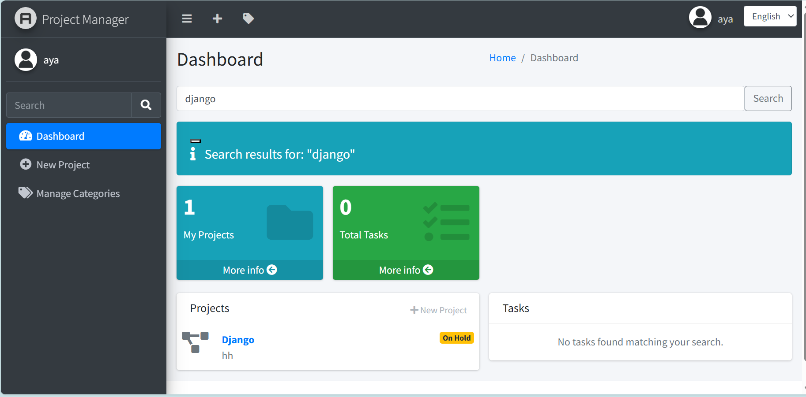
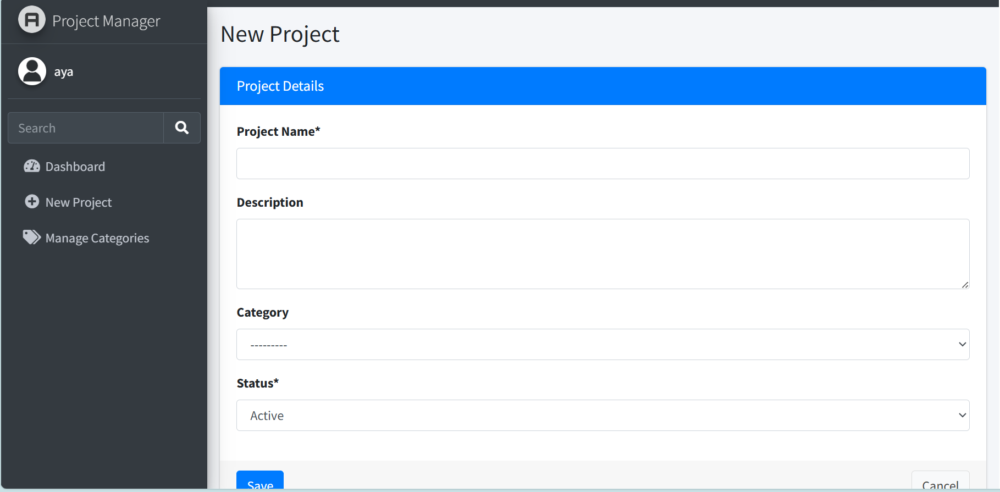
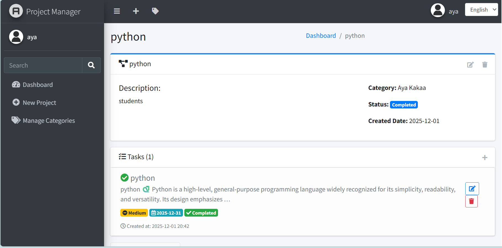
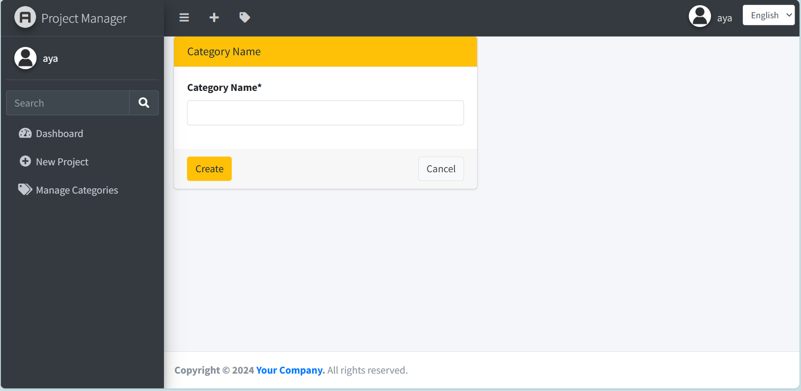

<div align="center">
  <h1>Django Project Manager</h1>
  <p>نظام متكامل لإدارة المشاريع والمهام، بواجهة مستخدم حديثة ودعم متعدد اللغات.</p>
  <p>A comprehensive project and task management system with a modern UI and multi-language support.</p>
  
  
  
  
  
</div>

---

## Table of Contents / جدول المحتويات

- [About the Project / عن المشروع](#about-the-project--عن-المشروع)
- [Features / المميزات](#features--المميزات)
- [Screenshots / لقطات الشاشة](#screenshots--لقطات-الشاشة)
- [Technologies Used / التقنيات المستخدمة](#technologies-used--التقنيات-المستخدمة)
- [Installation / التثبيت](#installation--التثبيت)
- [Usage / الاستخدام](#usage--الاستخدام)
- [Contributing / المساهمة](#contributing--المساهمة)
- [License / الرخصة](#license--الرخصة)
- [Contact / التواصل](#contact--التواصل)

---

## About the Project / عن المشروع

<div dir="rtl" lang="ar">
<p>
<strong>الوصف باللغة العربية:</strong><br>
نظام متكامل لإدارة المشاريع والمهام، مطور باستخدام إطار العمل Django. يتميز التطبيق بواجهة مستخدم حديثة وعصرية مبنية على AdminLTE، مع دعم كامل متعدد اللغات (العربية، الإنجليزية، والسويدية). يتيح التطبيق للمستخدمين إنشاء مشاريع متعددة، وتوزيعها إلى تصنيفات مخصصة، وإدارة المهام بكل سهولة مع تحديد الأولويات وتواريخ الاستحقاق. يوفر أيضًا إمكانية تخصيص الملف الشخصي للمستخدمين عبر رفع صور شخصية.
</p>
</div>

<p>
<strong>English Description:</strong><br>
A comprehensive project and task management system built with the Django framework. The application features a modern and sleek user interface built with AdminLTE, with full multilingual support (Arabic, English, and Swedish). It allows users to create multiple projects, organize them into custom categories, and manage tasks with ease by setting priorities and due dates. It also provides users with the ability to customize their profiles by uploading personal avatars.
</p>

---

## Features / المميزات

- ✅ User Authentication (Login, Register, Logout) / مصادقة المستخدم (دخول، تسجيل، خروج)
- ✅ User Profile Management with Custom Avatars / إدارة الملف الشخصي مع صور مخصصة
- ✅ Full CRUD Operations for Projects and Categories / عمليات CRUD كاملة للمشاريع والتصنيفات
- ✅ Task Management with Priority and Due Dates / إدارة المهام مع الأولوية وتاريخ الاستحقاق
- ✅ Advanced Search Functionality / وظيفة بحث متقدمة
- ✅ Responsive Design (Mobile-Friendly) / تصميم متجاوب (يدعم الهواتف)
- ✅ Internationalization (i18n) - Arabic, English, Swedish / تدويل (i18n) - عربي، إنجليزي، سويدي
- ✅ Professional UI (AdminLTE) / واجهة مستخدم احترافية (AdminLTE)

---

## Screenshots / لقطات الشاشة

<div align="center">
  <h3>Search / صفحة البحث</h3>
  

  <h3>Project Creation / إنشاء مشروع</h3>
  

  <h3>Dashboard / لوحة التحكم</h3>
  

  <h3>Project Detail / تفاصيل المشروع</h3>
  

  <h3>Category / التصنيفات</h3>
  
</div>

---

## Technologies Used / التقنيات المستخدمة

- **Backend:** Python, Django
- **Frontend:** HTML5, CSS3, JavaScript, Bootstrap 5, AdminLTE 3
- **Database:** PostgreSQL
- **Tools:** Git, GitHub

---

## Installation / التثبيت

To get a local copy up and running, follow these simple steps / للحصول على نسخة محلية وتشغيلها، اتبع هذه الخطوات البسيطة:

### Prerequisites / المتطلبات الأساسية

- Python 3.8+
- PostgreSQL
- pip

### Installation / التثبيت

1. Clone the repository / انسخ المستودع:
```sh
git clone https://github.com/your_username/django-project-manager.git
cd django-project-manager
```

2. Create and activate a virtual environment / إنشاء وتفعيل بيئة افتراضية:
```sh
python -m venv venv
# Windows
venv\Scripts\activate
# Mac/Linux
source venv/bin/activate
```

3. Install dependencies / تثبيت المتطلبات:
```sh
pip install -r requirements.txt
```

4. Configure your database in `settings.py` / إعداد قاعدة البيانات في PostgreSQL وتحديث settings.py:
```python
DATABASES = {
    'default': {
        'ENGINE': 'django.db.backends.postgresql',
        'NAME': 'project_manager_db',
        'USER': 'your_db_user',
        'PASSWORD': 'your_db_password',
        'HOST': 'localhost',
        'PORT': '5432',
    }
}
```

5. Apply migrations / تطبيق المايجريشنز:
```sh
python manage.py makemigrations
python manage.py migrate
```

6. Create a superuser / إنشاء مستخدم أدمن:
```sh
python manage.py createsuperuser
```

7. Run the development server / تشغيل الخادم المحلي:
```sh
python manage.py runserver
```

Open your browser at `http://127.0.0.1:8000/` to see the project running.

---

## Usage / الاستخدام

- Sign up or log in / تسجيل حساب أو تسجيل الدخول
- Create projects, categories, and tasks / إنشاء مشاريع وتصنيفات ومهام
- Manage tasks with priorities and due dates / إدارة المهام بالأولويات وتواريخ الاستحقاق
- Customize your profile and upload avatar / تعديل الملف الشخصي ورفع صورة
- Search projects and tasks using advanced search / البحث عن المشاريع والمهام

---

## Contributing / المساهمة

- Fork the repository or clone it / فرّع أو انسخ المشروع
- Create a new branch for your changes / أنشئ فرع جديد للتعديلات
- Submit a pull request / افتح Pull Request لدمج التغييرات

---

## License / الرخصة

This project is licensed under the MIT License / هذا المشروع مرخص تحت MIT License.

---

## Contact / التواصل

- GitHub: [your_username](https://github.com/your_username)
- Email: your_email@example.com

